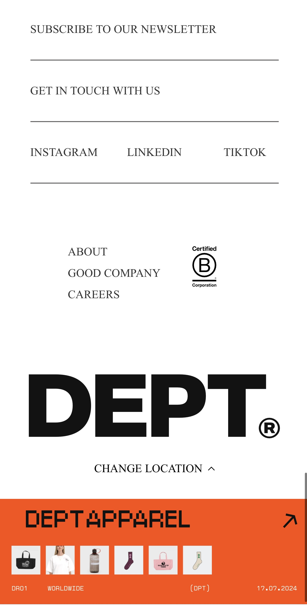

Ontwerp en maak een responsive website voor een startup.
De instructies voor deze opdracht staan in: [INSTRUCTIONS.md](https://github.com/fdnd-task/the-startup-responsive-interactieve-website/blob/main/docs/INSTRUCTIONS.md)

# Titel
Weather Your Way

Een interactieve en responsieve website waarmee gebruikers activiteiten kunnen plannen op basis van het weer. De website maakt gebruik van animatie voor een gebruiksvriendelijke ervaring.

# Overzicht

DEPT® Weather Planner

De opdracht was om een interactieve weerplanner te maken waarmee gebruikers hun activiteiten kunnen plannen op basis van de huidige  temperatuur.

Met de DEPT® Weather Planner kunnen gebruikers:

De temperatuur controleren op verschillende momenten van de dag.
Activiteiten filteren op basis van temperatuur.
Levendige animaties ervaren die de interacties verbeteren.
De applicatie is gemaakt met HTML, CSS, JavaScript, en GSAP voor geavanceerde animaties.

## Beschrijving

De DEPT® Weather Planner biedt de volgende functies:

Temperatuur-slider: Gebruikers kunnen de tijd van de dag selecteren, en de temperatuur wordt automatisch aangepast.
Activiteitensuggesties: De website toont welke activiteiten geschikt zijn voor de huidige temperatuur.
Dynamische animaties: Regen, zon en andere visuele effecten voegen een speels element toe.
Weersvoorspelling: Een overzicht van de temperatuur gedurende de dag.
"Read More"-functie: Meer tekst wordt zichtbaar gemaakt met  animatie.

## Foto's

Hieronder vind je een galerij met afbeeldingen van de website:

  
  
  
  
  
  
  
  
  
  

## Responsive Design

De website is ontworpen volgens het Mobile First principe. Hieronder een beschrijving per schermgrootte:

Mobiel (tot 768px):
layout met duidelijke teksten en eenvoudige navigatie.
De slider en interacties staan centraal.

Desktop (1024px en hoger):
verschillende animaties en visuele effecten.
Layout verdeelt interactieve elementen overzichtelijk over het scherm.

## Ontwerpkeuzes

Interacties
"Read More"-functie:

GSAP-animaties tonen verborgen tekst soepel.
Knop verandert naar "Read Less" voor duidelijke feedback.

Activiteitenfilter:
Dynamisch filteren van activiteiten gebaseerd op temperatuur.

Feedback: 

Waarschuwing bij ongeldige invoer.
Feedforward: 
Directe wijzigingen in temperatuurweergave bij het verschuiven van de slider.

Animaties:
Dynamische elementen zoals regen en zon.
Disney-principes:
Timing: Vloeiende bewegingen bij interacties.
Appeal: Kleurrijke en speelse visuele feedback.

## Fotos

Hieronder vind je een galerij met afbeeldingen van de website:

  
  
  
  
  
  
  
  
  
  

## Codefragmenten

HTML (Structuur van de temperatuur-sectie):

<section class="temperature-section">
  <input type="range" class="time-slider" min="0" max="23" value="12" />
  
20°C

</section>

CSS (Styling van de kaarten):

.activity-card {
  background: linear-gradient(145deg, #4c23d6, #6a5df8);
  border-radius: 1rem;
  transition: transform 0.3s ease;
}

.activity-card:hover {
  transform: scale(1.05);
  box-shadow: 0px 4px 15px rgba(0, 0, 0, 0.2);
}

JavaScript (Animatie met GSAP):

gsap.to(".rain-container", {
  opacity: 1,
  duration: 1,
  ease: "power2.out",
});

## Naamgeving

Voor consistentie en duidelijkheid heb ik de volgende conventies toegepast:

HTML:

Klassennamen volgen het BEM-principe (Block, Element, Modifier). Dit maakt de structuur overzichtelijk.
Voorbeeld:
.temperature-section: Hoofdsectie voor de temperatuurweergave.
.activity-card: Container voor een  activiteit.

CSS:
Gebruik van CSS-variabelen voor consistente styling.

body {
  /* Font */
  --font-family-base: 'Lato', Arial, sans-serif;

  /* Kleuren */
  --primary-color: #5115F7;
  --secondary-color: #ffffff;
  --tertiary-color: #f3f3ff;
  --highlight-color: #0099ff;
}

JavaScript:

Functienamen beschrijven duidelijk hun doel
Voorbeeld:
getTemperature(): Haalt de huidige temperatuur op.
filterActivities(): Filtert activiteiten op basis van temperatuur.
openModal(): Opent een modaal venster.

## Live Versie

 https://github.com/fatimahilali/the-startup-responsive-interactive-website

## Kenmerken
HTML

Semantische structuur met elementen zoals <header>, <nav>, <main>, <footer>.

CSS

Flexbox en CSS Grid voor flexibele en responsieve lay-outs.
Media queries om de website aan te passen aan verschillende schermformaten.
Styling met schaduwen, transities, en verschillende  kleurenpalet.

JavaScript

Dynamische componenten zoals carrousels en interactieve formulieren.
GSAP-animaties voor soepele overgangen.
Validatie van invoervelden voor verbeterde gebruiksvriendelijkheid.

## Bronnen

GSAP Documentation: greensock.com/docs
Web Docs: developer.mozilla.org
Instructies: INSTRUCTIONS.md
Youtube
Dept website (Footer)

## Licentie
This project is licensed under the terms of the [MIT license](./LICENSE).
